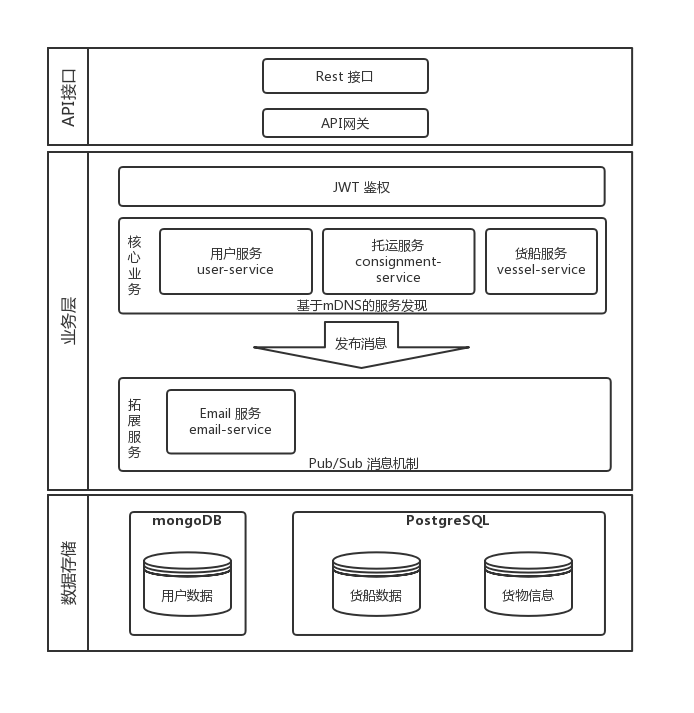

# micro-shippy
根据 [Golang 微服务教程](https://wuyin.io/2018/05/10/microservices-part-1-introduction-and-consignment-service/)，初步实践了下微服务的构建过程。


## 准备
### 安装 gRPC / protobuf
安装 [protoc compiler](https://github.com/google/protobuf/releases)

安装 gRPC 和 protoc go 插件
```
go get -u google.golang.org/grpc
go get -u github.com/golang/protobuf/protoc-gen-go
```

安装 go-micro 编译器插件 
```
go get -u github.com/micro/protobuf/proto
go get -u github.com/micro/protobuf/protoc-gen-go
```


## 系统架构
通过模拟搭建一套港口的货物管理平台，以 `Golang` 语言和 `go-mirco` 框架 主要实现了如下的服务。
- user-service 用户服务: 提供用户信息管理及鉴权服务
- consignment-service 货运服务：调度，分配货物到合适的货船
- vessel-service 货船服务：管理货轮信息
- email-service 邮件服务：提供邮件通知服务




## 微服务系统组成
在传统的软件开发中，整个应用虽然一般也会分为好几个模块，但一般最终会打包成一个应用来运行。微服务最大的变化便是将这些模块拆分为了一个个独立的程序。在这样的架构下，编写此微服务系统主要涉及到以下的技术。

### 服务间通信
#### RPC
微服务架构中各个服务都是独立的程序，当一个服务需要使用到其他服务的功能时，就需要一套通讯协议来实现远程调用接口。在 HTTP 服务中，一般会使用 Json 或者 Xml 的格式，这样格式的数据易读性好，使用便捷，但是由于使用字符串的形式传输，在数据量大的情况下编解码开销也会很大，导致传输的成本很高。因此这里使用了谷歌开源的 `gRPC` 通信框架，内置的 `protobuf` 协议使用二进制的数据帧来通信，为微服务之间提供高效的通信机制。

#### 消息队列
使用 RPC 的方式，可以直接调用其他服务的接口，但无法实现与其他服务的解耦，调用接口时必须保证此服务是在线的。对于一些调用后无需立即知道结果的服务，可以通过消息队列使用发布与订阅的模式，完全解耦，例如此项目中创建用户后，通过邮件服务给用户发送邮件的过程。

### 服务发现
直接使用 gRPC 时，需要手动指定服务端的地址和端口，这样任一服务重新部署 IP 或者端口发送变化后，此服务的相关服务都要跟着修改，管理起来会很麻烦。为解决服务间调用的问题，就需要引入服务发现，作为一个注册中心记录每个微服务的 IP 和端口，各微服务上线时会在它那注册，下线时会注销，其他服务可通过名字或 ID 直接找到该服务。

### API 网关
微服务之间可以通过 RPC 等方式来调用，对应一些需要开放给外部的接口，可以通过 API 网关方式，将 RPC 接口转换为一个 Rest 接口，可供外部客户端以 HTTP 的方式来调用。

### 容器服务
将一套系统拆分为多个微服务后，如何对这些微服务在分布式的环境下开发，测试和部署也是一个必须要考虑的问题。使用 Docker 技术，将微服务打包为一个个独立的容器，隔离操作系统环境影响，实现快速部署与管理各个微服务的状态。